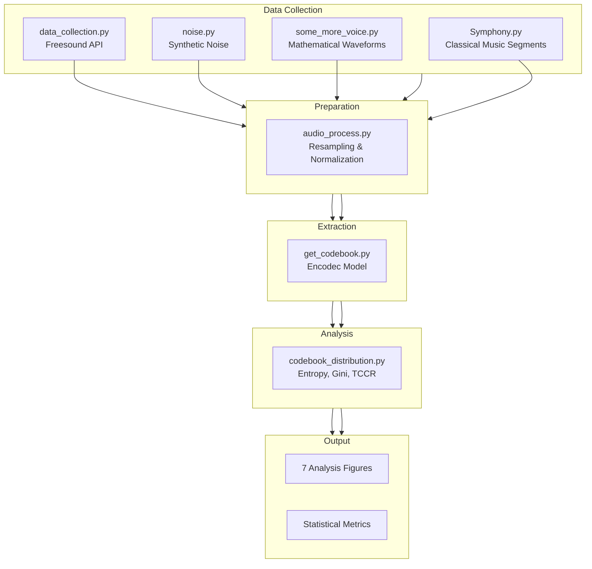

# GenAI Final Project: Audio Codebook Distribution Analysis

A comprehensive research project analyzing the statistical properties of discrete audio codes extracted using Facebook's Encodec neural audio codec across diverse audio categories.

## 📋 Table of Contents

- [Overview](#overview)
- [Project Architecture](#project-architecture)
- [Audio Categories](#audio-categories)
- [Installation](#installation)
- [Usage Guide](#usage-guide)
- [Analysis Metrics](#analysis-metrics)
- [Output Visualizations](#output-visualizations)
- [Directory Structure](#directory-structure)
- [Dependencies](#dependencies)

---

## 🎯 Overview

This project investigates how different audio types (speech, music, noise, synthetic waveforms) are represented in the discrete latent space of the Encodec neural audio codec. By extracting and analyzing codebook usage patterns, we can understand:

- **Codebook Efficiency**: How sparsely different audio types utilize the available codebook
- **Information Entropy**: The diversity and unpredictability of code usage across audio categories
- **Temporal Dynamics**: How quickly codes change over time in the latent representation
- **Distribution Inequality**: Whether code usage is concentrated or evenly distributed

The pipeline processes audio through 8 RVQ (Residual Vector Quantization) layers, each with a codebook size of 1024 discrete tokens.

---

## 🏗️ Project Architecture



---

## 🎵 Audio Categories

The project analyzes **13 distinct audio categories**:

| Category ID | Type | Description | Source |
|-------------|------|-------------|--------|
| `1_Synthetic` | 8-bit sounds | Mathematical waveforms, retro game audio | Freesound API |
| `2_Speech` | Human voice | Single speaker speech recordings | Freesound API |
| `3_Instrument` | Solo instruments | Piano and melodic instruments | Freesound API |
| `4_Percussion` | Drums | Rhythmic and transient sounds | Freesound API |
| `5_Crowd` | Complex voices | Multiple people talking | Freesound API |
| `6_Nature` | Environmental | Rain, natural broadband sounds | Freesound API |
| `7_ComplexMusic` | Orchestral | Symphony and complex music | Local files |
| `8_Noise` | Pure noise | White Gaussian, Uniform, Brownian | Generated |
| `9_Impulsive` | Transient | Gunshots, impulsive sounds | Freesound API |
| `10_Sine` | Pure tone | Mathematical sine waves | Generated |
| `11_Square` | Rich harmonics | Square waves (odd harmonics) | Generated |
| `12_Sawtooth` | Full harmonics | Sawtooth waves (all harmonics) | Generated |
| `13_HalfSine` | Nonlinear | Half-wave rectified sine | Generated |

---

## 📦 Installation

### Prerequisites

- Python 3.8+
- CUDA-compatible GPU (optional, for faster inference)

### Install Dependencies

```bash
pip install numpy torch torchaudio transformers librosa soundfile pydub scipy matplotlib seaborn tqdm requests
```

### Model Download

The Encodec model (`facebook/encodec_24khz`) will be automatically downloaded on first run of [`get_codebook.py`](get_codebook.py:1).

---

## 🚀 Usage Guide

### Step 1: Data Collection

#### Option A: Download from Freesound API

Edit [`data_collection.py`](data_collection.py:6) with your API key and run:

```bash
python data_collection.py
```

This downloads 30 samples per category from Freesound.

#### Option B: Generate Synthetic Audio

Generate mathematical waveforms:
```bash
python some_more_voice.py
```

Generate pure noise samples:
```bash
python noise.py
```

#### Option C: Process Symphony Files

Place symphony files in `Symphony/` folder and run:
```bash
python Symphony.py
```

### Step 2: Extract Discrete Codes

Extract codebook representations using Encodec:

```bash
python get_codebook.py
```

This processes all `.wav` and `.ogg` files in `dataset/` and saves `.npy` files to `extracted_codes/`.

**Output shape**: `[num_quantizers, frames]` where:
- `num_quantizers = 8` (RVQ layers)
- `frames` depends on audio duration

### Step 3: Statistical Analysis & Visualization

Generate all analysis figures:

```bash
python codebook_distribution.py
```

This produces 7 high-resolution academic figures (300 DPI).

---

## 📊 Analysis Metrics

### Shannon Entropy
Measures code distribution diversity (bits):
```python
H = -Σ p(x) * log₂(p(x))
```
Higher entropy = more diverse code usage

### Active Codes
Count of unique codes used per sample:
```python
active = |{c : count(c) > 0}|
```
Indicates codebook sparsity (max = 1024)

### Gini Coefficient
Measures inequality in code usage distribution:
- `0` = perfect equality (all codes used equally)
- `1` = maximum inequality (one code dominates)

### Temporal Code Change Rate (TCCR)
Proportion of adjacent frames with different codes:
```python
TCCR = Σ(code[t] ≠ code[t+1]) / (T-1)
```
Measures temporal volatility in latent space

---

## 📈 Output Visualizations

| Figure | Description | Metrics |
|--------|-------------|---------|
| **Figure 1** | Entropy Trajectory | Entropy vs RVQ Layer (1-8) |
| **Figure 2** | Entropy Heatmap | Global codebook entropy across layers |
| **Figure 3** | Code Distribution | Layer 1 codebook usage histograms |
| **Figure 4** | Active Codes | Bar chart with error bars |
| **Figure 5** | Variance Boxplot | Intra-class entropy distribution |
| **Figure 6** | Gini vs Entropy | Scatter plot of inequality vs diversity |
| **Figure 7** | TCCR vs Entropy | 2D clustering by temporal volatility |

All figures saved as PNG at 300 DPI for publication quality.

---

## 📁 Directory Structure

```
GenAI_Final/
├── README.md                    # This documentation
├── data_collection.py           # Freesound API downloader
├── noise.py                     # Synthetic noise generator
├── some_more_voice.py           # Mathematical waveform generator
├── Symphony.py                  # Symphony segment extractor
├── audio_process.py             # Audio preprocessing utilities
├── get_codebook.py              # Encodec code extractor
├── codebook_distribution.py     # Statistical analysis & visualization
├── dataset/                     # Raw audio files (.ogg, .wav)
│   ├── 1_Synthetic_*.ogg
│   ├── 2_Speech_*.ogg
│   ├── 10_Sine_*.wav
│   └── ...
├── extracted_codes/             # Discrete code representations (.npy)
│   ├── 1_Synthetic_*.npy
│   ├── 2_Speech_*.npy
│   └── ...
├── Symphony/                    # Source symphony files (input)
├── output/                      # Processed audio output
└── Figures                      # Generated visualizations
    ├── Figure_1_Entropy_Trajectory.png
    ├── Figure_2_Entropy_Heatmap.png
    ├── Figure_3_Full_Distributions.png
    ├── Figure_4_Active_Codes.png
    ├── Figure_5_Variance_Boxplot.png
    ├── Figure_6_Gini_vs_Entropy.png
    └── Figure_7_Temporal_Volatility_2D.png
```

---

## 🔧 Dependencies

| Package | Version | Purpose |
|---------|---------|---------|
| `torch` | ≥2.0 | Deep learning framework |
| `transformers` | ≥4.0 | Encodec model access |
| `librosa` | ≥0.10 | Audio processing |
| `numpy` | ≥1.20 | Numerical operations |
| `matplotlib` | ≥3.5 | Plotting |
| `seaborn` | ≥0.12 | Statistical visualization |
| `soundfile` | ≥0.12 | Audio I/O |
| `scipy` | ≥1.7 | Signal processing |
| `tqdm` | ≥4.60 | Progress bars |
| `requests` | ≥2.25 | API calls |
| `pydub` | ≥0.25 | Audio format conversion |

---

## 📝 License

This project is for academic research purposes.

---

## 👥 Authors

GenAI Final Project - Audio Codebook Distribution Analysis
